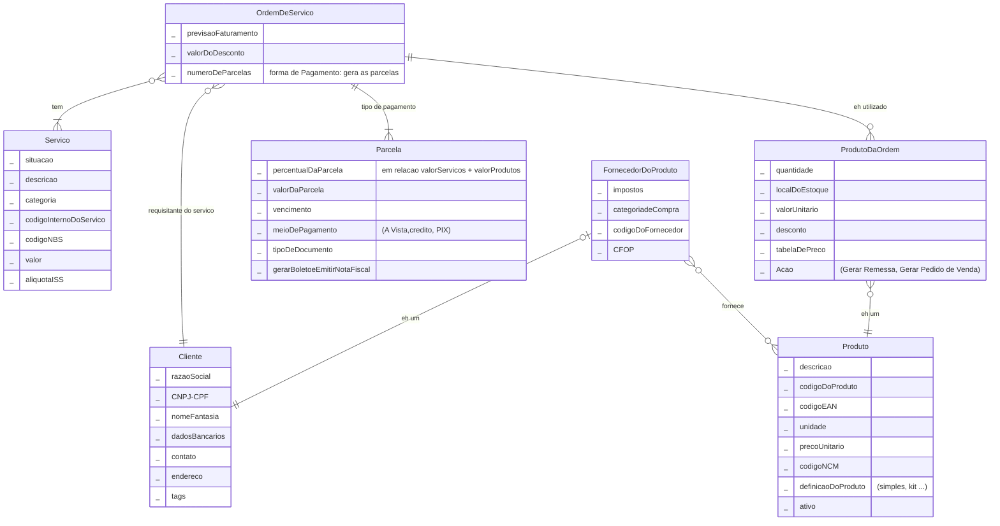

# Omie-Understanding-Integration
Repositório para documentar sistema Omie a fim realizar integração

```mermaid
erDiagram
    OrdemDeServico }o--|{ Servico: "tem"
    OrdemDeServico }o--|| Cliente: "requisitante do servico"
    OrdemDeServico ||--|{ Parcela: "tipo de pagamento"
    OrdemDeServico ||--o{ ProdutoDaOrdem: "eh utilizado"
    
    ProdutoDaOrdem }o--|| Produto: "eh um"

    FornecedorDoProduto |o--|| Cliente: "eh um"
    FornecedorDoProduto }o--o{ Produto: "fornece" 
    
    ProdutoDaOrdem {
        _ quantidade
        _ localDoEstoque
        _ valorUnitario
        _ desconto
        _ tabelaDePreco
        _ Acao "(Gerar Remessa, Gerar Pedido de Venda)"
    }

    FornecedorDoProduto{
        _ impostos
        _ categoriadeCompra
        _ codigoDoFornecedor
        _ CFOP
    }

    Produto {
        _ descricao
        _ codigoDoProduto
        _ codigoEAN
        _ unidade
        _ precoUnitario
        _ codigoNCM
        _ definicaoDoProduto "(simples, kit ...)"
        _ ativo
    }

    Parcela {
        _ percentualDaParcela "em relacao valorServicos + valorProdutos"
        _ valorDaParcela
        _ vencimento
        _ meioDePagamento "(A Vista,credito, PIX)"
        _ tipoDeDocumento
        _ gerarBoletoeEmitirNotaFiscal 
    }
    OrdemDeServico{
        _ previsaoFaturamento
        _ valorDoDesconto
        _ numeroDeParcelas "forma de Pagamento: gera as parcelas"
    }
    Cliente {
        _ razaoSocial
        _ CNPJ-CPF
        _ nomeFantasia
        _ dadosBancarios
        _ contato
        _ endereco
        _ tags
    }
    Servico {
        _ situacao
        _ descricao
        _ categoria
        _ codigoInternoDoServico
        _ codigoNBS
        _ valor
        _ aliquotaISS
    }
    
  
```
